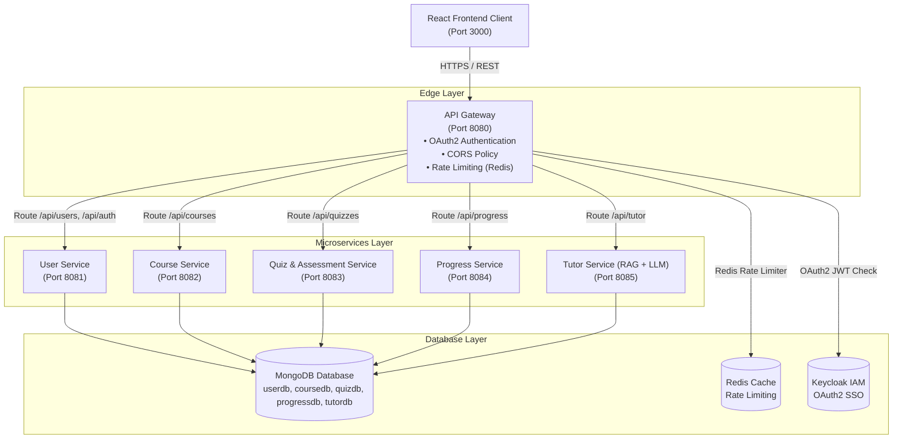

# IntelliLearn — AI Learning Platform with Intelligent Tutor

> A scalable, microservices-based learning management platform featuring an AI-powered Retrieval-Augmented Generation (RAG) tutor for personalized student learning.

[](https://www.oracle.com/java/)
[](https://spring.io/projects/spring-boot)
[](https://www.mongodb.com/)
[](https://www.docker.com/)
[](LICENSE)
[]()

---

## Project Overview

**IntelliLearn** is an intelligent microservices-based Learning Management System (LMS) designed for higher education and online learning. The platform pairs standard course administration, assessment, and progress tracking with an AI-driven Intelligent Tutor powered by **Retrieval-Augmented Generation (RAG)**. This architecture allows students to receive real-time, context-aware tutoring and instant explanations based directly on course materials provided by instructors.

The platform was intentionally constructed using a **Microservices Architecture** rather than a traditional monolithic design to achieve key software engineering goals:
- **Scalability**: High-throughput components (such as course access and AI tutoring requests) can scale independently without bottlenecking core user authentication.
- **Fault Isolation**: Outages in non-critical services (e.g., progress analytics) do not impede core learning activities like reading course materials or taking quizzes.
- **Independent Ownership & Deployment**: Distributed development teams can build, test, and deploy independent services without merge conflicts or cross-domain dependency locks.

---

## System Architecture

All incoming client requests pass through the central **API Gateway** before being routed to downstream microservices. Downstream microservices communicate independently with dedicated database instances hosted on **MongoDB**.



### Request Flow
1. **Client Isolation**: The React frontend client never communicates directly with internal microservices. All API traffic is routed through the central **API Gateway** on port `8080`.
2. **Gateway Responsibility**: The Gateway enforces OAuth2 authentication, applies Cross-Origin Resource Sharing (CORS) rules, and regulates request rates before proxying calls to internal service ports.
3. **Database Isolation**: Each microservice maintains complete data isolation by connecting to its dedicated MongoDB database namespace.

---

## Tech Stack

| Layer | Technology | Description |
| :--- | :--- | :--- |
| **Backend Framework** | Spring Boot 3.3.2 / Java 17 | Core microservices application runtime |
| **Database** | MongoDB 7.0 & Redis 7.0 | NoSQL document storage & key-value rate limiting cache |
| **Security & Auth** | OAuth 2.0 (Keycloak) + Per-Service API Key (`X-API-KEY`) | Dual-layer gateway and service security filter |
| **Frontend** | React.js (Vite) + Nginx | Single-page client web application |
| **API Documentation** | OpenAPI 3.0 / Swagger UI (springdoc) | Interactive endpoint documentation & testing |
| **Containerization** | Docker & Docker Compose | Ecosystem orchestration with single-command deployment |

---

## Team & Ownership Matrix

| Student ID | Team Role | Assigned Microservices & Responsibilities |
| :--- | :--- | :--- |
| **ITBIN-2313-0137** | Backend & API Gateway Lead | `user-service`, `course-service`, `api-gateway` |
| **ITBIN-2313-0007** | AI/RAG Services & Frontend Lead | `quiz-service`, `progress-service`, `tutor-service`, `client` |

*Note: All microservices, gateway routing, container orchestration, and frontend integrations are 100% fully implemented and verified.*

---

## Microservices Breakdown & Swagger UI Links

| Microservice | Port | Database | Key Endpoints | Swagger UI URL |
| :--- | :---: | :---: | :--- | :--- |
| **API Gateway** | `8080` | Redis | `/gateway/health`, `/api/**` | `http://localhost:8080/gateway/health` |
| **User Service** | `8081` | MongoDB (`userdb`) | `/api/users`, `/api/auth/login`, `/api/auth/register` | [http://localhost:8081/swagger-ui.html](http://localhost:8081/swagger-ui.html) |
| **Course Service** | `8082` | MongoDB (`coursedb`) | `/api/courses`, `/api/courses/{id}`, `/api/courses/{id}/enroll` | [http://localhost:8082/swagger-ui.html](http://localhost:8082/swagger-ui.html) |
| **Quiz Service** | `8083` | MongoDB (`quizdb`) | `/api/quizzes`, `/api/quizzes/{id}/submit`, `/api/quizzes/{id}/attempts/{userId}` | [http://localhost:8083/swagger-ui.html](http://localhost:8083/swagger-ui.html) |
| **Progress Service** | `8084` | MongoDB (`progressdb`) | `/api/progress`, `/api/progress/{userId}`, `/api/progress/{userId}/{courseId}` | [http://localhost:8084/swagger-ui.html](http://localhost:8084/swagger-ui.html) |
| **AI Tutor Service** | `8085` | MongoDB (`tutordb`) | `/api/tutor/ask`, `/api/tutor/summarize`, `/api/tutor/health` | [http://localhost:8085/swagger-ui.html](http://localhost:8085/swagger-ui.html) |
| **React Client** | `3000` | Nginx Static | Frontend user interface | [http://localhost:3000](http://localhost:3000) |

---

## Quick Start (Docker Compose Deployment)

### Prerequisites
- Docker Engine 24+
- Docker Compose v2+

### Running the Ecosystem
To build and start all 10 containers simultaneously, run:

```bash
docker compose up -d --build
```

### Verify Container Status
Check that all 10 containers are running:

```bash
docker compose ps
```

Expected containers:
1. `api-gateway` (Port 8080)
2. `client` (Port 3000)
3. `user-service` (Port 8081)
4. `course-service` (Port 8082)
5. `quiz-service` (Port 8083)
6. `progress-service` (Port 8084)
7. `tutor-service` (Port 8085)
8. `mongodb` (Port 27017)
9. `redis` (Port 6379)
10. `keycloak` (Port 8180)

---

## API Key Headers & Credentials

- **API Gateway Entry Point**: `http://localhost:8080`
- **Centralized Security Header**: `X-API-KEY`
- **Development Service Keys**:
  - User Service: `user-service-secret-key-123`
  - Course Service: `course-service-secret-key-456`
  - Quiz Service: `quiz-service-secret-key-101`
  - Progress Service: `progress-service-secret-key-789`
  - Tutor Service: `tutor-service-secret-key-999`