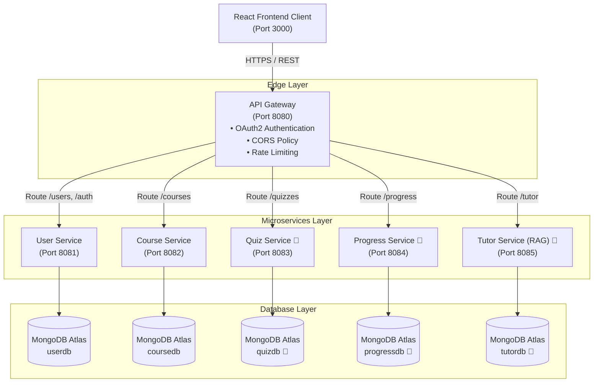

# IntelliLearn — AI Learning Platform with Intelligent Tutor

> A scalable, microservices-based learning management platform featuring an AI-powered Retrieval-Augmented Generation (RAG) tutor for personalized student learning.

[](https://www.oracle.com/java/)
[](https://spring.io/projects/spring-boot)
[](https://www.mongodb.com/cloud/atlas)
[](https://www.docker.com/)
[](LICENSE)
[]()

---


## Project Overview

**IntelliLearn** is an intelligent microservices-based Learning Management System (LMS) designed for higher education and online learning. The platform pairs standard course administration, assessment, and progress tracking with an AI-driven Intelligent Tutor powered by **Retrieval-Augmented Generation (RAG)**. This architecture allows students to receive real-time, context-aware tutoring and instant explanations based directly on course materials provided by instructors.

The platform was intentionally constructed using a **Microservices Architecture** rather than a traditional monolithic design to achieve key software engineering goals:
- **Scalability**: High-throughput components (such as course access and AI tutoring requests) can scale independently without bottlenecking core user authentication.
- **Fault Isolation**: Outages in non-critical services (e.g., progress analytics) do not impede core learning activities like reading course materials or taking quizzes.
- **Independent Ownership & Deployment**: Distributed development teams can build, test, and deploy independent services without merge conflicts or cross-domain dependency locks.

---

## System Architecture

All incoming client requests pass through the central **API Gateway** before being routed to downstream microservices. Downstream microservices communicate independently with dedicated database instances hosted on **MongoDB Atlas**.



### Request Flow
1. **Client Isolation**: The React frontend client never communicates directly with internal microservices. All API traffic is routed through the central **API Gateway** on port `8080`.
2. **Gateway Responsibility**: The Gateway enforces OAuth2 authentication, applies Cross-Origin Resource Sharing (CORS) rules, and regulates request rates before proxying calls to internal service ports.
3. **Database Isolation**: Each microservice maintains complete data isolation by connecting to its dedicated MongoDB Atlas database namespace.

---

## Tech Stack

| Layer | Technology | Description |
| :--- | :--- | :--- |
| **Backend Framework** | Spring Boot 3.4.2 / Java 17 | Core microservices application runtime |
| **Database** | MongoDB Atlas (Cloud) | Multi-tenant NoSQL document storage |
| **Frontend** | React.js | Single-page client web application |
| **API Documentation** | OpenAPI 3.0 / Swagger UI (springdoc) | Interactive endpoint documentation & testing |
| **Security & Auth** | OAuth 2.0 + Per-Service API Key (`X-API-KEY`) | Dual-layer gateway and service security filter |
| **Containerization** | Docker & Docker Compose | Containerization and environment orchestration |

---

## Team & Ownership

| Student ID | Team Role | Assigned Microservices |
| :--- | :--- | :--- |
| **ITBIN-2313-0137** | Backend & API Gateway Lead | `user-service`, `course-service`, `api-gateway` |
| **ITBIN-2313-0007** | AI/RAG Services & Frontend Lead | `quiz-service`, `progress-service`, `tutor-service`, `client` |

---

## Microservices Breakdown

### 1. User Management Service (`user-service`)
- **Port**: `8081`
- **Purpose**: Manages user registration, credential authentication via BCrypt hashing, profile management, and API key assignment.
- **Database Namespace**: `userdb` (MongoDB Atlas)
- **Swagger UI**: [http://localhost:8081/swagger-ui/index.html](http://localhost:8081/swagger-ui/index.html)

#### Key Endpoints:
| Method | Endpoint | Description | Auth Required |
| :--- | :--- | :--- | :--- |
| `POST` | `/auth/register` | Register a new user account | No |
| `POST` | `/auth/login` | Authenticate user credentials | No |
| `GET` | `/users` | Retrieve all registered users | Yes (`X-API-KEY`) |
| `GET` | `/users/{id}` | Retrieve specific user by ID | Yes (`X-API-KEY`) |
| `PUT` | `/users/{id}` | Update existing user details | Yes (`X-API-KEY`) |
| `DELETE` | `/users/{id}` | Delete user account by ID | Yes (`X-API-KEY`) |

---

### 2. Course Management Service (`course-service`)
- **Port**: `8082`
- **Purpose**: Handles creation, modification, catalog listing of courses, and student course enrollments.
- **Database Namespace**: `coursedb` (MongoDB Atlas)
- **Swagger UI**: [http://localhost:8082/swagger-ui/index.html](http://localhost:8082/swagger-ui/index.html)

#### Key Endpoints:
| Method | Endpoint | Description | Auth Required |
| :--- | :--- | :--- | :--- |
| `POST` | `/courses` | Create a new course entry | Yes (`X-API-KEY`) |
| `GET` | `/courses` | Retrieve catalog of all courses | Yes (`X-API-KEY`) |
| `GET` | `/courses/{id}` | Retrieve specific course details | Yes (`X-API-KEY`) |
| `PUT` | `/courses/{id}` | Update course metadata or materials | Yes (`X-API-KEY`) |
| `DELETE` | `/courses/{id}` | Delete a course by ID | Yes (`X-API-KEY`) |
| `POST` | `/courses/{id}/enroll` | Enroll a student into a course | Yes (`X-API-KEY`) |
| `GET` | `/courses/{id}/enrollments` | List all student enrollments for a course | Yes (`X-API-KEY`) |

---

### 3. API Gateway (`api-gateway`)
- **Status**: 🚧 *In Progress*
- **Port**: `8080`
- **Purpose**: Central routing, rate limiting, and CORS handling layer for incoming client traffic.

---

### 4. Quiz Service (`quiz-service`)
- **Status**: 🚧 *In Progress*
- **Port**: `8083`
- **Purpose**: Quiz creation, automated scoring, and student assessment handling.

---

### 5. Progress Tracking Service (`progress-service`)
- **Status**: 🚧 *In Progress*
- **Port**: `8084`
- **Purpose**: Analytics, course completion tracking, and performance reports.

---

### 6. Intelligent Tutor Service (`tutor-service`)
- **Status**: 🚧 *In Progress*
- **Port**: `8085`
- **Purpose**: AI-powered Retrieval-Augmented Generation (RAG) engine providing intelligent student assistance based on course documents.

---

### 7. React Frontend (`client`)
- **Status**: 🚧 *In Progress*
- **Port**: `3000`
- **Purpose**: Web UI interface for students, instructors, and system administrators.

---

## API Key Security

Every active microservice enforces strict per-service API Key verification using an internal `OncePerRequestFilter`. Requests sent to protected endpoints must present a valid `X-API-KEY` HTTP header.

| Microservice | Default Test API Key | Required Header Format |
| :--- | :--- | :--- |
| **`user-service`** | `user-service-secret-key-123` | `X-API-KEY: user-service-secret-key-123` |
| **`course-service`** | `course-service-secret-key-456` | `X-API-KEY: course-service-secret-key-456` |
| **`quiz-service`** | `quiz-service-secret-key-789` | `X-API-KEY: quiz-service-secret-key-789` |
| **`progress-service`** | `progress-service-secret-key-101` | `X-API-KEY: progress-service-secret-key-101` |
| **`tutor-service`** | `tutor-service-secret-key-202` | `X-API-KEY: tutor-service-secret-key-202` |
| **`api-gateway`** | `api-gateway-secret-key-303` | `X-API-KEY: api-gateway-secret-key-303` |

---

## Prerequisites

Ensure the following tools are installed on your system before building or executing the project:

- **Java Development Kit (JDK)**: Java 17 or higher
- **Apache Maven**: 3.8+ (or use included `./mvnw` wrapper in each service)
- **Docker & Docker Compose**: Docker Engine 20.10+ and Docker Compose v2+
- **Node.js**: 18+ (for frontend `client`)
- **MongoDB Atlas**: An active MongoDB Atlas cluster URI

---

## Getting Started / Running the System

### 1. Environment Setup
Create a `.env` file at the root directory of the repository (refer to `.env.example`):

```env
MONGODB_URI=mongodb+srv://<username>:<password>@cluster0.be9f7gl.mongodb.net/?retryWrites=true&w=majority&appName=Cluster0

USER_SERVICE_API_KEY=user-service-secret-key-123
COURSE_SERVICE_API_KEY=course-service-secret-key-456
QUIZ_SERVICE_API_KEY=quiz-service-secret-key-789
PROGRESS_SERVICE_API_KEY=progress-service-secret-key-101
TUTOR_SERVICE_API_KEY=tutor-service-secret-key-202
API_GATEWAY_KEY=api-gateway-secret-key-303
```

### 2. Local Development (Individual Services)
To run a microservice locally for development:

```bash
# Navigate to the target service folder
cd user-service

# Run using the Maven wrapper
./mvnw spring-boot:run
```

For `course-service`:
```bash
cd course-service
./mvnw spring-boot:run
```

### 3. Docker Compose Deployment
To build and launch all services simultaneously via Docker:

```bash
docker compose up --build
```

> **Note**: Database instances are hosted externally on **MongoDB Atlas** (cloud-managed). No local database container is created by Docker Compose.

---

## Environment Variables

| Variable Name | Purpose | Example Value |
| :--- | :--- | :--- |
| `MONGODB_URI` | Base connection string for MongoDB Atlas cluster | `mongodb+srv://<user>:<pass>@cluster0.be9f7gl.mongodb.net/...` |
| `USER_SERVICE_API_KEY` | Secret API Key for `user-service` authorization | `user-service-secret-key-123` |
| `COURSE_SERVICE_API_KEY` | Secret API Key for `course-service` authorization | `course-service-secret-key-456` |
| `QUIZ_SERVICE_API_KEY` | Secret API Key for `quiz-service` authorization | `quiz-service-secret-key-789` |
| `PROGRESS_SERVICE_API_KEY` | Secret API Key for `progress-service` authorization | `progress-service-secret-key-101` |
| `TUTOR_SERVICE_API_KEY` | Secret API Key for `tutor-service` authorization | `tutor-service-secret-key-202` |
| `API_GATEWAY_KEY` | Secret API Key for `api-gateway` authorization | `api-gateway-secret-key-303` |

---

## API Documentation

Once services are running, interactive OpenAPI / Swagger UI documentation is accessible at the following URLs:

- **User Service Swagger UI**: [http://localhost:8081/swagger-ui/index.html](http://localhost:8081/swagger-ui/index.html)
- **Course Service Swagger UI**: [http://localhost:8082/swagger-ui/index.html](http://localhost:8082/swagger-ui/index.html)
- **Quiz Service Swagger UI**: `http://localhost:8083/swagger-ui/index.html` *(🚧 In Progress)*
- **Progress Service Swagger UI**: `http://localhost:8084/swagger-ui/index.html` *(🚧 In Progress)*
- **Tutor Service Swagger UI**: `http://localhost:8085/swagger-ui/index.html` *(🚧 In Progress)*

---

## Testing

All REST API endpoints have been rigorously tested using:
1. **Interactive Swagger UI**: Endpoints verified by authorizing via the `X-API-KEY` "Authorize" modal.
2. **cURL Commands**: Verified header evaluation, validation constraints, and HTTP status codes (`200 OK`, `201 Created`, `400 Bad Request`, `401 Unauthorized`, `404 Not Found`, `409 Conflict`).
3. **Postman Collections**: Comprehensive test suites and response screenshots are provided in the project documentation package.

---

## Project Structure

```
intellitutor-platform
├── .env.example
├── .gitignore
├── README.md
├── docker-compose.yml
├── api-gateway/
├── client/
├── course-service/
│   ├── mvnw
│   ├── pom.xml
│   └── src/
│       ├── main/
│       │   ├── java/com/intellilearn/course_service/
│       │   │   ├── CourseServiceApplication.java
│       │   │   ├── controller/CourseController.java
│       │   │   ├── dto/
│       │   │   ├── exception/
│       │   │   ├── model/Course.java, Enrollment.java
│       │   │   ├── repository/CourseRepository.java, EnrollmentRepository.java
│       │   │   ├── security/ApiKeyAuthFilter.java, OpenApiConfig.java, SecurityConfig.java
│       │   │   └── service/CourseService.java
│       │   └── resources/application.properties
├── progress-service/
├── quiz-service/
├── tutor-service/
└── user-service/
    ├── mvnw
    ├── pom.xml
    └── src/
        ├── main/
        │   ├── java/com/intellilearn/user_service/
        │   │   ├── UserServiceApplication.java
        │   │   ├── config/OpenApiConfig.java
        │   │   ├── controller/UserController.java
        │   │   ├── dto/
        │   │   ├── exception/
        │   │   ├── model/User.java
        │   │   ├── repository/UserRepository.java
        │   │   ├── security/ApiKeyFilter.java, SecurityConfig.java
        │   │   └── service/UserService.java
        │   └── resources/application.properties
```

---

## Contribution Guidelines

### Branching Strategy
- Main branch: `main` (production-ready code only).
- Feature branches: `feature/<service-name>` (e.g., `feature/user-service`, `feature/course-service`).

### Commit Message Convention
Follow standard Conventional Commits:
- `feat: add course enrollment endpoint`
- `fix: correct MongoDB Atlas URI database selection`
- `docs: update root README architecture diagram`

### Pull Request Process
1. Create and test changes on your feature branch.
2. Ensure `./mvnw clean install` builds cleanly without errors.
3. Open a Pull Request targeting `main`.
4. Code review approval by at least one team member is required before merging.

---

## License

This project is licensed under the [MIT License](LICENSE).