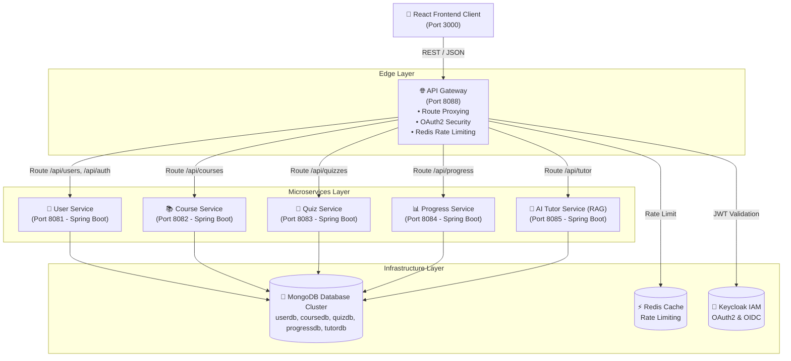

# IntelliLearn — AI-Powered Microservices Learning Platform

> A modern, enterprise-grade Learning Management & Tutoring System built on a **Microservices Architecture** with an integrated **AI Tutor (RAG Engine)**, **Role-Based Workflows (Student & Instructor)**, and **Keycloak SSO Authentication**.

[](https://www.oracle.com/java/)
[](https://spring.io/projects/spring-boot)
[](https://nodejs.org/)
[](https://react.dev/)
[](https://vitejs.dev/)
[](https://www.mongodb.com/)
[](https://www.docker.com/)
[](https://www.keycloak.org/)

---

## Executive Overview

**IntelliLearn** is an intelligent, full-stack microservices platform designed for modern higher education and online learning. The system pairs course administration, assessment, and real-time student analytics with an **AI-driven Intelligent Tutor** powered by **Retrieval-Augmented Generation (RAG)** and OpenRouter LLMs.

### Why Microservices?
- **Horizontal Scalability**: High-demand workloads (e.g. AI tutoring requests and course catalog browsing) scale independently without affecting core user authentication.
- **Fault Isolation**: An outage in analytics or quiz logging will not prevent students from accessing learning materials or taking courses.
- **Service Decoupling**: Independent services connect to isolated MongoDB database namespaces, enforcing strict domain boundaries.

---

## Key Features

### 👨‍🎓 Student Experience
- **Interactive Course Catalog**: Browse, search, filter, and enroll in curated technology courses.
- **AI Command Terminal**: Ask questions directly to an AI Tutor trained on course topics, request summaries, and get code explanations.
- **Real-Time Progress Tracking**: Dynamic progress bars, course completion percentages, and milestone badges.
- **Interactive Quiz Assessments**: Take quizzes with automated evaluation, score breakdowns, and attempt history.

### 👨‍🏫 Instructor Console (Full-Screen Dashboard)
- **Course Authoring**: Create, configure, and publish new courses with custom categories and modules.
- **Quiz Creator**: Dynamic multi-choice quiz builder with real-time correct answer selection and option management.
- **Submissions & Performance Analytics**: Monitor student quiz submission scores, completion dates, and overall assessment metrics.
- **Dedicated Navigation**: Independent, role-scoped workflow preventing accidental mixing with student views.

---

## System Architecture & Data Flow

All external client traffic passes through the **API Gateway** (`port 8088`), which handles rate-limiting, CORS, and OAuth2 JWT verification before proxying requests to downstream microservices.



---

## Microservices Architecture Matrix

| Service Name | Stack / Runtime | Port | Database | Primary Responsibilities |
| :--- | :--- | :---: | :---: | :--- |
| **`api-gateway`** | Spring Cloud Gateway | `8088` | Redis | Single entry point, CORS, rate limiting, and JWT validation |
| **`user-service`** | Spring Boot 3.3 | `8081` | `userdb` | Authentication fallback, user registration, profiles & roles |
| **`course-service`** | Spring Boot 3.3 | `8082` | `coursedb` | Course creation, catalog search, module management & enrollments |
| **`quiz-service`** | Spring Boot 3.3 | `8083` | `quizdb` | Quiz builder, dynamic evaluation, submission history |
| **`progress-service`**| Spring Boot 3.3 | `8084` | `progressdb` | Student milestone tracking, analytics, and completion percent |
| **`tutor-service`** | Spring Boot + RAG | `8085` | `tutordb` | OpenRouter LLM integration, AI tutoring chat, content summarizer |
| **`client`** | React 19 + Vite | `3000` | — | Single Page Application (SPA) with full mobile responsiveness |

---

## OpenAPI & Swagger Documentation Hub

IntelliLearn exposes interactive **Swagger Documentation** across all microservices for inspecting raw OpenAPI specs and testing endpoints:

| Documentation Interface | URL |
| :--- | :--- |
| **API Gateway Aggregated Swagger** | [http://localhost:8088/swagger-ui.html](http://localhost:8088/swagger-ui.html) |
| **User Service Swagger** | [http://localhost:8081/swagger-ui.html](http://localhost:8081/swagger-ui.html) |
| **Course Service Swagger** | [http://localhost:8082/swagger-ui.html](http://localhost:8082/swagger-ui.html) |
| **Quiz Service Swagger** | [http://localhost:8083/swagger-ui.html](http://localhost:8083/swagger-ui.html) |
| **Progress Service Swagger** | [http://localhost:8084/swagger-ui.html](http://localhost:8084/swagger-ui.html) |
| **AI Tutor Service Swagger** | [http://localhost:8085/swagger-ui.html](http://localhost:8085/swagger-ui.html) |

---

## Tech Stack & Engineering Tools

- **Frontend**: React 19, React Router v7, Lucide Icons, Vanilla CSS (Design Tokens, Glassmorphism, Responsive Grid System)
- **Backend & Gateway**: Java 17, Spring Boot 3.3.2, Spring Cloud Gateway
- **Databases & Cache**: MongoDB Atlas / Local MongoDB 7.0, Redis 7.0
- **AI / LLM**: OpenRouter API (RAG Engine + Topic Summarizer)
- **Security**: Keycloak SSO (OAuth2 / OpenID Connect) + `X-API-KEY` microservice filter
- **DevOps & Orchestration**: Docker, Docker Compose, Nginx

---

## Quick Start & Deployment Guide

### Prerequisites
- [Docker Engine 24+](https://docs.docker.com/engine/install/)
- [Docker Compose v2+](https://docs.docker.com/compose/install/)
- Node.js 20+ (for local client development)

### 1. Run via Docker Compose (Recommended)

To launch the complete ecosystem (10 containers) in detached mode:

```bash
docker compose up -d --build
```

#### Verify Running Containers
```bash
docker compose ps
```

Expected containers:
- `api-gateway` (`:8088`)
- `client` (`:3000`)
- `user-service` (`:8081`)
- `course-service` (`:8082`)
- `quiz-service` (`:8083`)
- `progress-service` (`:8084`)
- `tutor-service` (`:8085`)
- `mongodb` (`:27017`)
- `redis` (`:6379`)
- `keycloak` (`:8180`)

---

### 2. Local Frontend Development

If you prefer running the React client locally while microservices run in Docker:

```bash
# Navigate to client directory
cd client

# Install dependencies
npm install

# Start Vite development server
npm run dev
```

Open [http://localhost:3000](http://localhost:3000) in your browser.

---

## 3. Team Member Work Breakdown Matrix

| Student Name / ID | Role | Microservice Name | Key Responsibilities & Endpoints |
| :--- | :--- | :--- | :--- |
| **ITBIN-2313-0137** | Gateway Lead & Member | `user-service` & `course-service` | API Gateway, OAuth 2.0, Rate Limiting, API Key Auth.<br>**Endpoints**: `/api/users/profile`, `/api/courses`, `/api/courses/{id}` |
| **ITBIN-2313-0007** | Frontend Lead & Member | `quiz-service`, `progress-service`, `tutor-service` | React SPA Client, RAG LLM integration, API Key Auth.<br>**Endpoints**: `/api/quizzes/submit`, `/api/progress/{userId}`, `/api/tutor/chat` |

---

## Security & Environment Variables

Key service security headers:
- **Gateway Entry**: `http://localhost:8088`
- **Microservice Key Header**: `X-API-KEY`

| Service | Environment Variable | Default Development Value |
| :--- | :--- | :--- |
| **User Service** | `USER_SERVICE_API_KEY` | `user-service-secret-key-123` |
| **Course Service** | `COURSE_SERVICE_API_KEY` | `course-service-secret-key-456` |
| **Progress Service** | `PROGRESS_SERVICE_API_KEY` | `progress-service-secret-key-789` |
| **AI Tutor Service** | `OPENROUTER_API_KEY` | *(Set in `.env`)* |

---

## License

Distributed under the **MIT License**. See `LICENSE` for details.